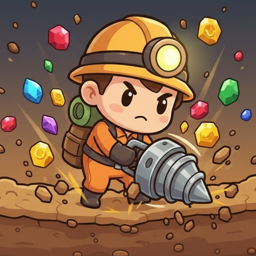
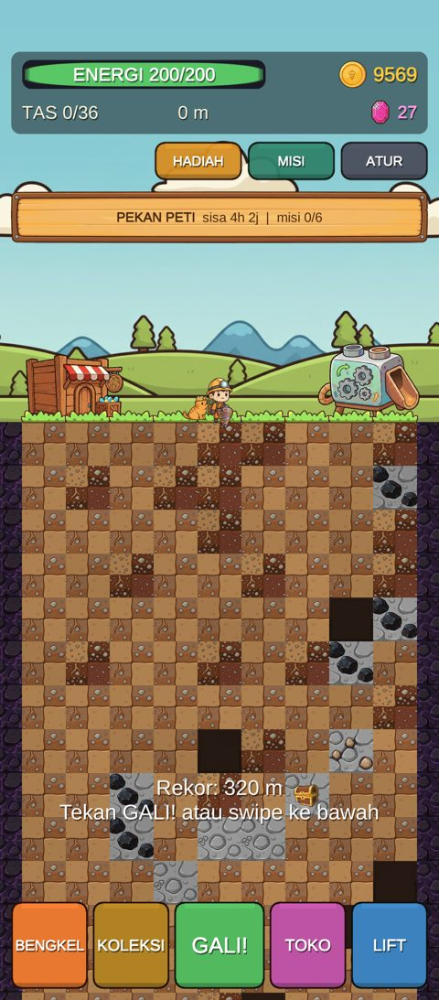
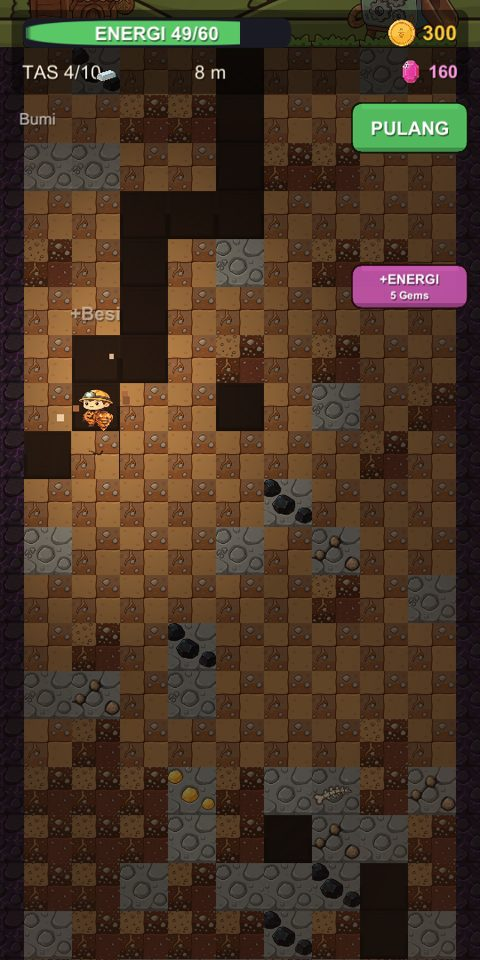
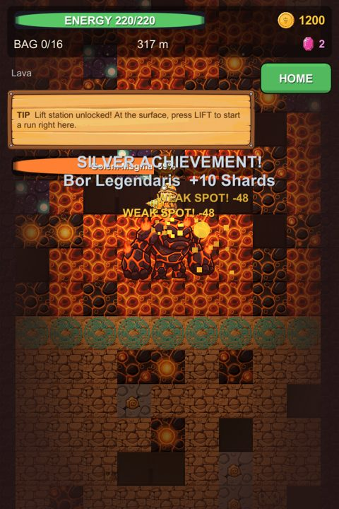
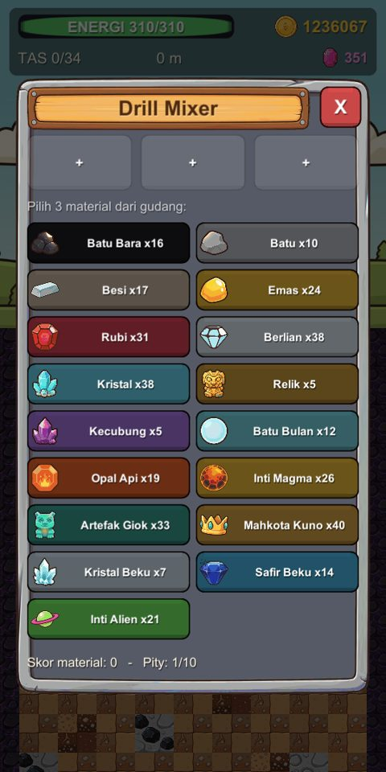
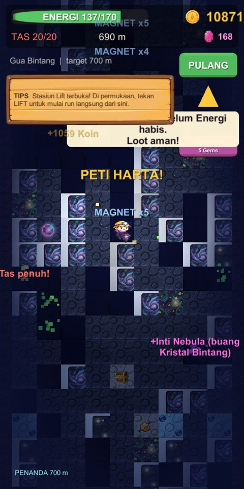
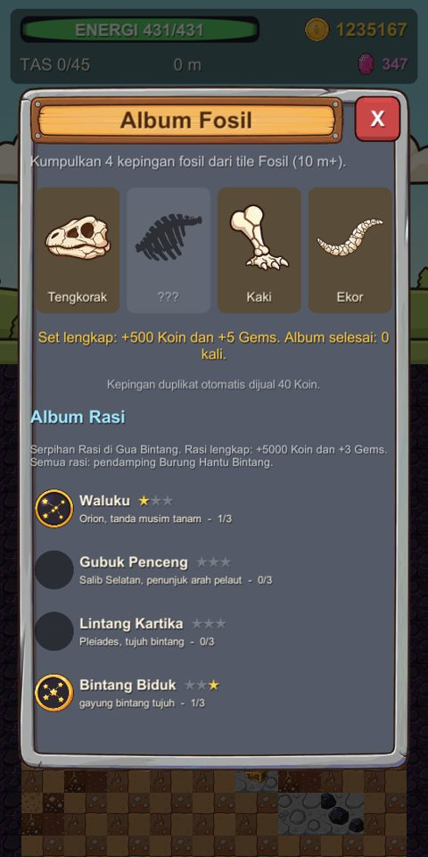

<h1 align="center">Drillfall</h1>

<b>Gali ke bawah. Bawa pulang harta. Racik bor legendaris.</b> 
Game kasual mobile dari Gameku Studio.

<a href="../../releases/latest"><b>⬇ Unduh APK terbaru (Android)</b></a> · <a href="https://drillfall.gamekustudio.com">drillfall.gamekustudio.com</a>

---

## Tentang game

Swipe untuk menggali, kumpulkan bijih, lalu pulang sebelum Energi habis. Jual hasil tambang, upgrade bor, dan campur 3 material di **Drill Mixer** untuk mendapatkan bor baru.

- **7 bioma**: Bumi, Gua Kristal, Lava, Reruntuhan Kuno, Es Abadi, Alien, sampai Gua Bintang tanpa batas.
- **Penjaga Gerbang**: 7 boss yang dikalahkan dengan menggali titik lemahnya.
- **Drill Mixer**: 14 bor, 6 rarity, dan resep rahasia.
- **Pendamping dan skin**, event mingguan dan musiman, Season Pass gratis, prestasi, Album Rasi Bintang.
- **Papan skor Kedalaman Terdalam**: bersaing dengan pemain lain.

| | | |
|---|---|---|
|  |  |  |
|  |  |  |

## Cara install

1. Buka halaman **[Releases](../../releases/latest)** lalu unduh file `Drillfall-v<versi>.apk`.
2. Buka file dari notifikasi atau folder **Download**.
3. Kalau muncul peringatan, izinkan **Instal dari sumber tidak dikenal** untuk browser atau aplikasi File yang kamu pakai, lalu tekan **Instal**.
4. Untuk update: unduh APK versi baru dan instal di atas versi lama. Progres tetap ada.

Butuh Android 8.0 ke atas (64-bit).

## Penting

- **Wajib internet.** Drillfall menyimpan progres di cloud dan tidak bisa dimainkan tanpa koneksi.
- **Versi uji:** progres terikat ke perangkat. **Uninstall atau hapus data aplikasi akan menghapus progres.** Penautan akun menyusul.
- APK ini ditandatangani untuk uji coba, belum versi Google Play.

## Tautan

- Situs: https://drillfall.gamekustudio.com
- Kebijakan Privasi: https://drillfall.gamekustudio.com/privacy.html
- Syarat Layanan: https://drillfall.gamekustudio.com/terms.html

---

## English (short)

**Drillfall** is a casual mobile digging game by Gameku Studio: dig down, bring treasure home, and craft legendary drills in the Drill Mixer. 7 biomes, 7 gate guardians, events, a free Season Pass, and a Deepest Dig leaderboard.

- **Download:** get the latest APK from **[Releases](../../releases/latest)** and allow installing from unknown sources when asked. Android 8.0+ (64-bit).
- **Internet required:** progress is saved in the cloud.
- **Test build:** progress is tied to the device; uninstalling or clearing app data deletes it.
- Website, privacy policy and terms: https://drillfall.gamekustudio.com

---

© 2026 Gameku Studio.
